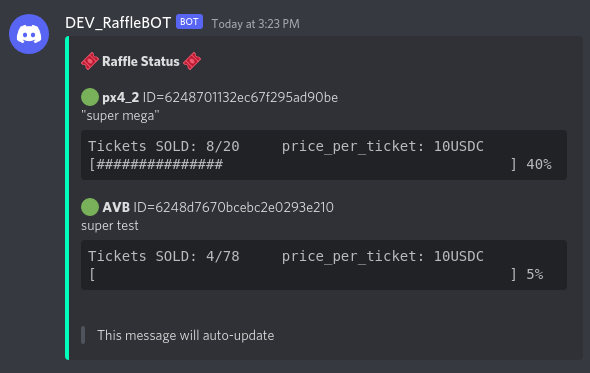

# DRRB - DiscordRustRaffleBot


#### This is an implementation of a Raffle Management bot for discord servers written in Rust.

! It BOT will need its API-Backend - this bot is just a frontend.

# About



---

## Commands

### Status Commands

| command        | result                                                     |
|----------------|------------------------------------------------------------|
| `~status`      | prints info about status commands                          |
| `~status list` | prints out a short message about the raffles               |
| `~status perm` | prints out a short message about the raffles (not deleted) |
| `~status full` | prints out a full message about the raffles                |

[all users can use this command]

---

### Raffle Commands

| command                                                                                  | result                            |
|------------------------------------------------------------------------------------------|-----------------------------------|
| `~raffle`                                                                                | prints info about raffle commands |
| `~raffle add <title> <ticket_price> <ticket_amount> <ticket_currency> "<description>"`   | adds a new raffle                 |
| `~raffle list`                                                                           | list all raffles                  |
| `~raffle delete <raffle_id>`                                                             | deletes a raffle                  |
| `~raffle start <raffle_id>`                                                              | deletes a raffle                  |
| `~raffle stop <raffle_id>`                                                               | deletes a raffle                  |

[only users with correct role can use his command]

---

### Ticket Commands

| command                                      | result                            |
|----------------------------------------------|-----------------------------------|
| `~ticket`                                    | prints info about ticket commands |
| `~ticket me`                                 | shows tickets for user            |
| `~ticket add <raffle_id> <spl_tx_signature>` | adds a new ticket for user        |
| `~ticket list`                               | lists all tickets                 |
| `~ticket delete`                             | deletes a ticket                  |

[all users can use this command]


---

### Sample for commands use:

1. Add a new raffle:
    1. `~raffle add <title> <ticket_price> <ticket_amount> <ticket_currency> "<description>"`
2. View your raffle:
    1. `~raffle list`
3. Add a Ticket:
    1. `~ticket add <raffle_id> <spl_tx_signature>`
4. View your ticket:
    1. `~ticket list`
5. Print a permanent Status view:
    1. `~status perm`

## Development

### ENVs / Config

```env
RAFFLE_API_URL=https://<YOURHOST>:8080/api/v1
RAFFLE_API_KEY=<API-KEY>
DISCORD_TOKEN=<DISCORD_TOKEN>
RUST_LOG=error
DELETE_MESSAGE=true
MESSAGE_TIMER=10
GUILD_ID=<YOURGUILDID>
ROLE_ID=<YOURROLEID>
CHANNEL_ID=<YOURCHANNELID>
LOOP_SLEEP=10
```
